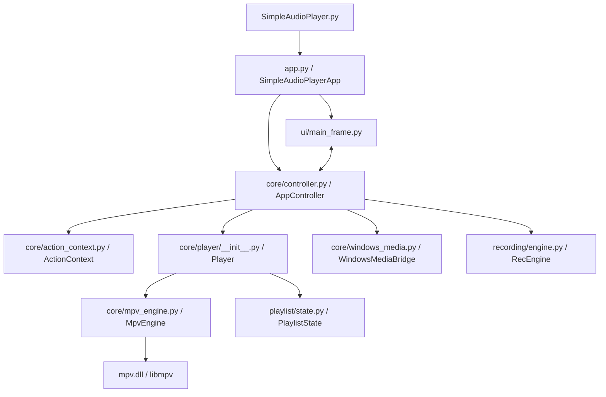
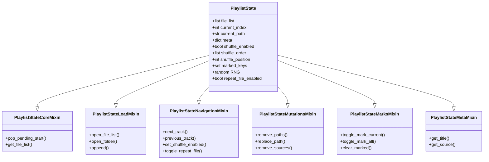
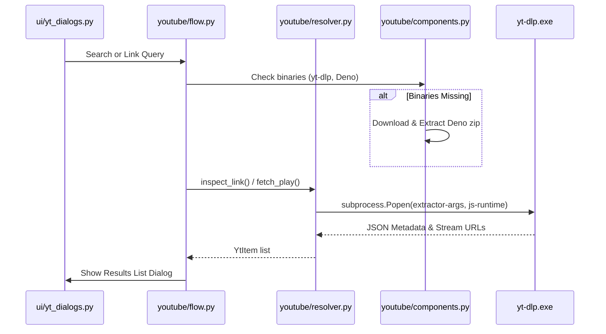

# Simple Audio Player: Comprehensive Technical Reference

This document serves as an exhaustive, self-contained technical manual for the **Simple Audio Player** codebase. It outlines the architectural patterns, state models, module interfaces, and system integrations, allowing any AI model or developer to understand, maintain, and expand the project without reading the entire source directory.

---

## 1. High-Level Architecture & Design Patterns

Simple Audio Player is structured as a desktop application using **wxPython** for the graphical user interface and **libmpv** (via Python bindings) for media playback. The application follows a modified **Model-View-Controller (MVC)** architectural design optimized for accessibility (screen readers) and modular code reuse.

### 1.1 Key Architecture Concepts
1. **Model-View-Controller separation**: 
   - **View (`ui/`)**: Renders components, captures keyboard characters, and defines menus. It is mostly stateless and delegates actions to the controller.
   - **Controller (`core/controller.py`)**: Intercepts actions from the GUI, global hotkeys, or Windows Media session keys, executes the appropriate business logic, and synchronizes the view state.
   - **Model (`core/player/` & `playlist/`)**: Encapsulates media player actions and playlist mutation logic.
2. **The Mixin Pattern (Composition over Inheritance)**:
   To prevent monolithic classes, both the `Player` model, the `PlaylistState`, and `MainFrame` are divided into functional mixins. For instance, `Player` inherits from separate mixins for playback controls, file loading, filters, and window embedding.
3. **Action-Driven Execution**:
   Keyboard hotkeys and menu items are bound to unique string identifiers (e.g., `play_pause`, `seek_forward`). The controller maps these strings to executable lambda expressions, passing them through an `ActionContext` which encapsulates the required system interfaces.
4. **Single-Instance IPC Lock (`AppGuard`)**:
   Upon startup, the application initializes an `AppGuard` handle. If a secondary instance is launched (e.g., when a user double-clicks an associated media file), the secondary instance serializes the command-line arguments to JSON, sends them via a local IPC message handler to the primary instance, focuses the primary window, and terminates.

### 1.2 MainFrame Mixin Structure (`ui/mainwin/`)
To keep the main UI frame manageable, `MainFrame` is split into distinct functional mixins:
- **`MainFrameMenuMixin` (`ui/mainwin/menu.py`)**: Responsible for building and managing the application's entire menu bar. It defines 8 main menus (File, Playback, Navigate, Bookmarks, Marked Files, Video Options, Recording, Help). It dynamically manages bookmark slots (1-9), seek step presets, and percentage jumps.
- **`MainFrameEventsMixin` (`ui/mainwin/events.py`)**: Integrates frame-level event handlers. It supports drag-and-drop file operations via a custom `FileDropTarget` class, captures window close events (releasing hooks and saving positional states), maps accelerator tables, and processes the F1 context help trigger.
- **`MainFrameStateMixin` (`ui/mainwin/state.py`)**: Manages the visual state and enablement of menu items. It exposes:
  - `set_file_loaded(loaded)`: Dynamically enables or disables ~25 playback-related menu options depending on whether media is active.
  - `set_recording_state(state)`: Updates UI items to reflect recording states (started, paused, stopped).
  - Toggles checkboxes for shuffle, repeat, silence removal, bookmarks, video options, and local-only file actions (renaming/deletion).
  - `refresh_shortcuts()`: Programmatically rebuilds menu labels to match custom user-defined hotkeys.

### 1.3 App Initialization & Debounced Shell Queuing
The application entry point in `app.py` employs a deferred startup sequence:
- **`_BootstrapController`**: Exposes a minimal action interface prior to the full initialization of `AppController` (e.g. during splash screens or component verification).
- **Deferred Initialization**: The true `AppController` is created asynchronously via `wx.CallAfter` inside `_initialize_controller_and_startup()` to prevent blocking the GUI thread.
- **IPC Shell Debouncing**: If multiple files are double-clicked in Windows Explorer concurrently, they are serialized and passed via the IPC guard. To prevent loading latency, `app.py` uses a 120ms timer (`_shell_open_timer`) that aggregates files into a temporal `_pending_open_paths` buffer, passing them to the player as a single consolidated playlist command.

---

## 2. Core Player Engine & Context (`core/`)

The core engine coordinates low-level audio operations, system callbacks, keyboard hooks, and background disk activities.

### 2.1 Action Context (`core/action_context.py`)
`ActionContext` acts as the shared state parameter passed through all system actions. It contains:
- References to `player`, `settings`, `marks`, `file_pos`, `favs`, and `frame`.
- Selection bounds (`selection_start`, `selection_end`, `selection_path`) for the A-B Loop feature.
- YouTube states (`yt_pl` for session lists, `yt_now` for the playing stream's metadata).
- **Verbosity System**: Connects to settings to offer dual-mode screen-reader output:
  - `speak(beginner_text, advanced_text)`: Instructs TTS to read the short `advanced` string if the user is in advanced mode, or the descriptive `beginner` string if in beginner mode.
  - `announce_volume_value()`: Speaks current volume settings.
- **File Info Debounce**: Keeps a `file_info_press_count` and `file_info_last_press` timestamp. Multi-presses within a 0.3-second window trigger escalating detail cycles (1st press: announces filename, 2nd press: announces absolute folder path, 3rd press: copies path to clipboard).

### 2.2 AppController (`core/controller.py`)
`AppController` coordinates the backend components:
- Coordinates events from `MpvEngine`, `WindowsMediaBridge`, `RecEngine`, and `KeyboardHandler`.
- Manages the primary settings validation and dialog loops.
- Registers a 1-second `wx.Timer` thread-safe callback (`_ensure_media_timer_started`) to keep the SMTC timeline slider in sync with the active playback position.
- Gracefully handles shutdown (`shutdown()`), which halts recording threads, stops the global keyboard listener, stores active settings, saves playback coordinates, and calls DLL unregister commands.

### 2.3 MpvEngine (`core/mpv_engine.py`)
`MpvEngine` is a direct wrapper around `mpv.MPV`. It configures the MPV instance with the following default options:
- `vo="gpu"`: Renders using GPU hardware acceleration.
- `osc=False`: Disables the built-in MPV on-screen controller.
- `keep_open="no"`: Tells MPV to close the file upon termination.
- `input_default_bindings=False`, `input_vo_keyboard=False`: Disables default MPV input configurations to ensure the wxPython GUI retains control of keyboard input.
- `network-timeout=10`: Sets HTTP network connection limits to 10 seconds to prevent hanging on corrupted streams.
- `media-controls=yes`, `input-media-keys=yes`: Forces native OS media hooks.

#### Audio Processing Filters (FFmpeg `lavfi` Graph Integration)
`MpvEngine` implements custom audio filters via FFmpeg's `lavfi` interface:
1. **Pre-amplification & Normalization**:
   - Enabled via: `dynaudnorm=f=150:g=15,alimiter=limit=0.95`.
   - Continuous volume scaling above 100%: If volume is $\le 100\%$, the standard MPV volume property is scaled. For volume values between $100\%$ and $1000\%$, the engine locks the MPV master volume at $100\%$ and inserts an active pre-amplification volume gain filter (`lavfi=[volume=gain]`) mapped continuously from $1.0$ to $10.0$ to prevent clipping.
2. **Mono Downmixing**:
   - Appends: `aformat=channel_layouts=mono`.
   - Label: `@audiomono`.
3. **Silence Removal**:
   - Constructs a `silenceremove` filter string labeled `@silenceremove` using values configured in settings.

#### Sound Card Switching & MPV State Serialization
Queries `audio_device_list` from MPV. When switching devices, it validates target availability. If the target is lost, it falls back to `"auto"`.
To support hot-swapping display windows or recreating the MPV instance, `MpvEngine` provides:
- `snapshot_runtime_state()`: Serializes active playback properties (volume, speed, current device, pause state, position).
- `restore_runtime_state(state)`: Restores these properties on a clean MPV instance.
- `recreate_with_window(window_id)`: Rebuilds the underlying MPV wrapper, attaching it to a new window handle without interrupting playback.

### 2.4 Keyboard Handler (`core/keyboard_handler.py`)
Provides global hotkeys using `pynput.keyboard.Listener`:
- Maps physical keys to unique action strings.
- Maintains a `_pressed_keys` set to deduplicate key-repeat events triggered by holding a physical button.
- Exposes `set_enabled(bool)` to pause keyboard hook capture when configuration modals are active.

### 2.5 Media Library Scanner (`core/media_library.py`)
Contains folder scanning functions:
- `collect_audio_files(folder_path, recursive)`: Scans directories, filters by `AUDIO_EXTENSIONS` set, and returns sorted lists.
- `collect_audio_files_with_progress(folder_path, on_progress, should_cancel)`: Implements a two-phase progress-reporting walker. Phase 1 walks the tree counting total files. Phase 2 filters extensions and populates the list. It triggers progress updates to the caller and handles cancellations gracefully.

### 2.6 Player Composition (`core/player/`)
The `Player` class composed of multiple mixins:
- `PlayerWindowMixin`: Normalizes Windows handles (using `& 0xFFFFFFFF` bitmask checks) and embeds the player screen into wxPython panels.
- `PlayerLoadMixin`: Commands `PlaylistState` to update track indexing and loads URLs or filesystem paths into `MpvEngine`.
- `PlayerPlaybackMixin`: Handles master seek, volume, speed step, and loop point configurations.
- `PlayerFiltersMixin`: Compiles active settings into filter strings.
- `PlayerStateMixin`: Maps queries like `is_shuffle_enabled` or `are_all_files_marked` to internal playlist objects.
- `PlayerLifecycleMixin`: Listens to the `end-file` MPV callback. Depending on user-defined behaviors, it advances tracks, loops the current file, or stops. It checks if the `repeat_file` state is enabled before applying standard EOF actions.
- **`PlayerFilesMixin` (`core/player/files.py`)**: Manages file lifecycle states on the playlist. It handles deleting active files from disk safely (`delete_current_file()`), closing current items, clearing playlists, renaming active paths, and removing specific indices.

### 2.7 System Media Transport Controls (`core/windows_media.py`)
`WindowsMediaBridge` connects to Windows' `SystemMediaTransportControls` (SMTC) using `winsdk`:
- Creates a `MediaPlayer` instance to register shell controls.
- Updates track metadata (Title, Artist) via `display_updater`.
- Updates timeline ranges (elapsed, remaining, total duration) via `SystemMediaTransportControlsTimelineProperties`.
- Maps physical media buttons (Play/Pause, Next, Previous, Fast-Forward, Rewind) back to application command string tokens.
- Defines `AppUserModelID` via `ctypes` (shell32 DLL) to enable correct taskbar stacking.
- Incorporates change detection to skip redundant metadata updates and handles graceful degradation on non-Windows platforms.

---

## 3. State Management & Playlists (`playlist/`)

State management tracks playlists, active queues, and indexing offsets.

### 3.1 State Mutation Mixins
1. **`PlaylistStateLoadMixin`**: Sets track listings, resets marking arrays, and triggers shuffle array calculations when loading new items. Exposes functions to append streams to the queue without interrupting active playback.
2. **`PlaylistStateNavigationMixin`**: Implements track traversal.
   - *Sequential Mode*: Standard indexing operations ($index \pm 1$) with wrapping bounds checks.
   - *Shuffle Mode*: Calculates random track permutation arrays ensuring the current track remains at index `0`. Traverses via a dedicated `shuffle_position` index.
   - *Repeat File*: Toggles single-file loops, bypassing standard list navigation.
3. **`PlaylistStateMutationsMixin`**: Deletes or updates filenames, shifts indices, and adjusts the active shuffle arrays safely. Exposes `remove_sources(urls)` to clean up external streams (e.g. removing YouTube playlists).
4. **`PlaylistStateMarksMixin`**: Keeps a `marked_keys` set of normalized file paths that the user selected for batch file operations.
5. **`PlaylistStateMetaMixin`**: Associates string URLs with titles and sources (useful for stream descriptors).

### 3.2 Async Playlist Scanning (`playlist/info.py`)
Provides detailed metadata stats for playlists:
- Spawns an `InfoJob` using `ThreadPoolExecutor` and a `queue.Queue` to calculate cumulative sizes and track lengths.
- Creates a headless, audio-disabled, video-disabled MPV instance (`vo="null"`, `ao="null"`, `vid="no"`, `idle="yes"`) to probe track lengths of non-active files.
- Employs a thread-safe global cache dictionary (`_DUR`) and mutex locks to store resolved file durations.
- Communicates progress to the UI using a thread-safe `wx.ProgressDialog`.

---

## 4. Configuration & Windows Integration (`config/`)

### 4.1 Constants (`config/constants.py`)
Defines the global settings constants:
- App identity parameters (`APP_NAME`, `APP_VERSION="1.3.0"`, `DOMAIN`).
- Core ranges: `VOLUME_MIN=0`, `VOLUME_MAX=1000` (representing maximum gain including preamp), `SPEED_MIN=0.5`, `SPEED_MAX=4.0`.
- Supported media sets: `AUDIO_EXTENSIONS` (11 formats) and `VIDEO_EXTENSIONS` (13 formats).
- YouTube options: default region/language keys, update repo URLs, and file markers.

### 4.2 SettingsManager (`config/settings_manager.py`)
Loads and saves configuration parameters from/to `APPDATA/Simple Audio Player/settings.ini` via `configparser`.
- Configures default parameters for Audio, UI, YouTube, Recording, and Playback sections.
- Handles automated migrations (such as moving legacy silence settings to the new `silence_removal` section).
- Manages key-bind dictionaries for local, secondary, and global hotkeys.
- Exposes `_save_save_on_close_only()` to handle quick flags updates without rewriting full files.

### 4.3 Localization (`config/localization.py`)
Handles internationalization (i18n) via Python's standard `gettext` library:
- Scans `locale/` subdirectories to discover compiled catalog (`.mo`) files.
- Maps language codes to display strings (e.g. `ar` for Arabic, `cs` for Czech).
- Exposes `_rebind_loaded_modules()` which programmatically monkey-patches the gettext bind `_()` across all active Python modules upon user configuration updates.

### 4.4 Windows File Association Registry (`config/file_associations.py`)
Integrates the player into the Windows Explorer shell:
1. Writes ProgID registry classes `SimpleAudioPlayer.media` under `HKCU\Software\Classes`.
2. Registers executable paths for both script and compiled configurations under `HKCU\Software\Classes\Applications`.
3. Creates Explorer context menu entries: `"Play with Simple Audio Player"`.
4. Appends ProgID entries under file extension `OpenWithProgids` keys.
5. Updates Windows Capabilities registry branches so the app appears under System Default Programs.
6. Calls `SHChangeNotify(0x08000000)` (Shell Association Change) to instantly refresh file icons.
7. Offers `unregister_file_associations()` to clean up paths upon application uninstallation.

---

## 5. System Actions (`app_actions/`)

The application actions are divided into separate, modular modules:

| Module | Action Functions | Description |
| :--- | :--- | :--- |
| `playback_actions.py` | `toggle_play_pause`, `seek_backward`, `seek_forward`, `change_volume`, `change_speed`, `jump_to_percent`, `start_selection`, `end_selection`, `toggle_verbosity`, `go_to_time`, `set_seek_step`, `announce_elapsed` | Standard playback adjustments. Incorporates seek step presets, verbosity triggers, time jumpers (launches `GoToTimeDialog`), speed scales, and spoken audio feedback announcements. |
| `file_actions.py` | `open_file`, `open_folder`, `open_link`, `open_here`, `open_props`, `paste_files`, `say_file`, `goto_file`, `restore_last` | Local file management actions. Handles folder loading, file deletion, and per-file coordinates restoration. Exposes `say_file` for multi-press info feedback. |
| `marked_file_actions.py` | `copy_marked_to_folder`, `move_marked_to_folder`, `delete_marked_files`, `mark_current_file`, `copy_marked_to_clipboard` | Threaded file manipulation actions. Uses `_CancelFlag` structures to cancel active file migration operations without GUI lag. |
| `bookmark_actions.py` | `add_mark`, `manage_marks`, `jump_mark_slot` | Interactive bookmarks UI controller. Maps Alt+digit hotkeys to bookmark slots. |
| `favorite_actions.py` | `manage_favs`, `_open_item` | Stores stream references and YouTube playlist linkages locally in JSON files. |
| `device_actions.py` | `open_sound_cards` | Launches device dialog and updates MPV settings. |
| `help_actions.py` | `open_guide`, `open_changes`, `show_about`, `open_contact_tg` | Handles localized document delivery. Finds the closest localized guides by querying directory catalogs. |
| `recording_actions.py` | `start_rec`, `pause_resume_rec`, `stop_rec`, `open_rec_folder` | Audio recording controls. Binds hardware cues and manages output format directories. |

---

## 6. YouTube Integration Workflow (`youtube/`)

The YouTube module handles stream extraction, searches, caching, downloads, and component updates.

### 6.1 Facade & State Tracking (`youtube/actions.py` & `youtube/state.py`)
- **`actions.py`**: Serves as the public interface for the YouTube module. Exposes methods like `open_yt`, `search_yt`, and video utilities.
- **`state.py`**: Manages YouTube session states. It tracks:
  - Active playback items, pending jobs, and prefetch lists.
  - Exposes `mk_ses()`, `set_ses()`, and `clear_ses()` which halts active threads via `CancelFlag` triggers.

### 6.2 Component Management (`youtube/components.py` & `youtube/startup.py`)
- **Binary Dependencies**: Manages `yt-dlp.exe` and `deno.exe`.
- **`components.py`**: Implements remote tag checks, downloads missing packages, and handles self-updates via `--update-to channel@latest` CLI parameters.
- **`startup.py`**: Inspects local executables on startup. Offers a dialog with "Don't show again" checkboxes.

### 6.3 Link Validation & Stream Resolution (`youtube/link_validator.py` & `youtube/resolver.py`)
- **`link_validator.py`**: Parses inputs against YouTube URL variants (e.g. `/shorts/`, `/live/`, `?list=` playlist tags, channel signatures).
- **`resolver.py`**: Formulates CLI extraction arguments.
  - Implements a **3-tier fallback** for resolution: (1) `--dump-single-json -f format`, (2) `-g -f format`, (3) fallback to general `-g`.
  - Implements rate-limiting checks by parsing HTTP 429 errors from standard output/error pipes. Exposes thread-local diagnostic buffers for error tracking.

### 6.4 Search Engine (`youtube/search.py` & `youtube/results.py`)
- **`search.py`**: Implements search operations using `py-yt-search`. Integrates async loops to fetch search listings and parses pagination items via `continuationKey` tokens.
- **`results.py`**: Controls search dialog views. Handles infinite scrolling pagination by lazyloading next pages as the user scrolls.

### 6.5 Prefetch Pipeline (`youtube/flow.py`)
To prevent track-switching latency:
1. Spawns `_PREP_POOL` (Thread executor) to resolve upcoming track URLs in the background.
2. Caches stream structures inside a `_PREP_DONE` dictionary (up to 200 items).
3. When switching tracks: If the next track is cached, it immediately loads the pre-resolved stream. If it is still resolving, the app plays a speech cue ("Loading next video...") and starts playback as soon as the background worker finishes.

### 6.6 Audio Downloader (`youtube/download.py` & `youtube/video.py`)
- **`download.py`**: Invokes `yt-dlp` using `-x --audio-format m4a` options to download audio directly. It monitors stream progress by parsing CLI outputs via regex patterns.
- **`video.py`**: Maps download commands to active playing URLs.

---

## 7. Storage, User Interface & Local Database

### 7.1 Database Stores (`bookmarks/`, `favorites/`, `positions/`)
Data is stored locally in the user config directory (`APPDATA/Simple Audio Player/`) using JSON structures. To prevent data corruption, all writes are atomic: the application writes data to a temporary file, calls `Flush()`, and then replaces the target database file atomically using `os.replace`.

1. **`MarkStore` (`bookmarks/store.py`)**: Stores file bookmarks keyed by normalized path strings.
2. **`FavStore` (`favorites/store.py`)**: Manages user favorite streams, categorized by types: `video`, `playlist`, `combined`, or `generic_stream`.
3. **`PosStore` (`positions/store.py`)**: Tracks elapsed playtime coordinates for automatic playback resumption.

### 7.2 UI Preferences Dialog (`ui/prefs/` & `ui/custom_controls.py`)
The preferences modal (`ui/prefs/dialog.py`) contains a sidebar navigation tree containing 8 settings panels:
- **`GeneralSettingsPanel`**: Controls language codes, updates, and shell file-association options.
- **`AudioSettingsPanel`**: Adjusts seek thresholds, normalize filters, mono toggles, and loop rules.
- **`SilenceRemovalSettings`**: Offers basic/advanced toggle buttons. Explains RMS/Peak detectors, and manages silence intervals.
- **`ShortcutSettings` & `GlobalShortcutSettings`**: Supports recording keyboard captures for local hotkeys (via wx events) and global hotkeys (via `pynput`). Features validation checks to alert users to key conflicts.
- **`RecordingSettingsPanel`**: Adjusts format targets, sample values, and destination folders.
- **`YouTubeSettingsPanel`**: Manages video limits, updates channels, and prefetching options.
- **`BackupRestorePanel`**: Exports settings, restores settings, and cleans folders.

---

## 8. Build, Packaging & Update Systems

### 8.1 App Updates Coordinator (`update/`)
Orchestrates application update workflows:
- **`update/service.py`**: Fetches remote `info.json` files and parses changelog lists. It verifies local system architectures and downloads update archives.
- **`update/actions.py`**: Triggers background update checks. Launches `AppUpdateDialog` and runs the standalone updater executable.

### 8.2 Standalone Update Installer (`updater/main.py`)
`updater.exe` is a standalone Python binary that performs update tasks:
- Inspects parent process PIDs using `kernel32.OpenProcess`.
- Blocks execution using `WaitForSingleObject` until the parent application terminates.
- Applies the update: extracts files, copies assets (skipping its own executable to avoid lock errors), and restarts the application.

### 8.3 Build and Script Configurations
- **`SimpleAudioPlayer.spec`**: Exposes PyInstaller configurations. Bundles translation packages (`locale/`), help documentation (`docs/`), sound diagnostic files, and imports Windows media dependencies (`winsdk.windows.media`).
- **`simple_audio_player.iss`**: Script for compiling Inno Setup installers. Associates 22 media extensions, writes the `.sap_installed` marker file, and configures uninstallation paths.
- **Development Scripts**:
  - `update_version.py`: Updates version strings across all manifest files.
  - `update_pot.py`: Re-extracts translation tags and creates `gettext` files.
  - `gather_context.py`: Consolidated script to generate context files for development models.
